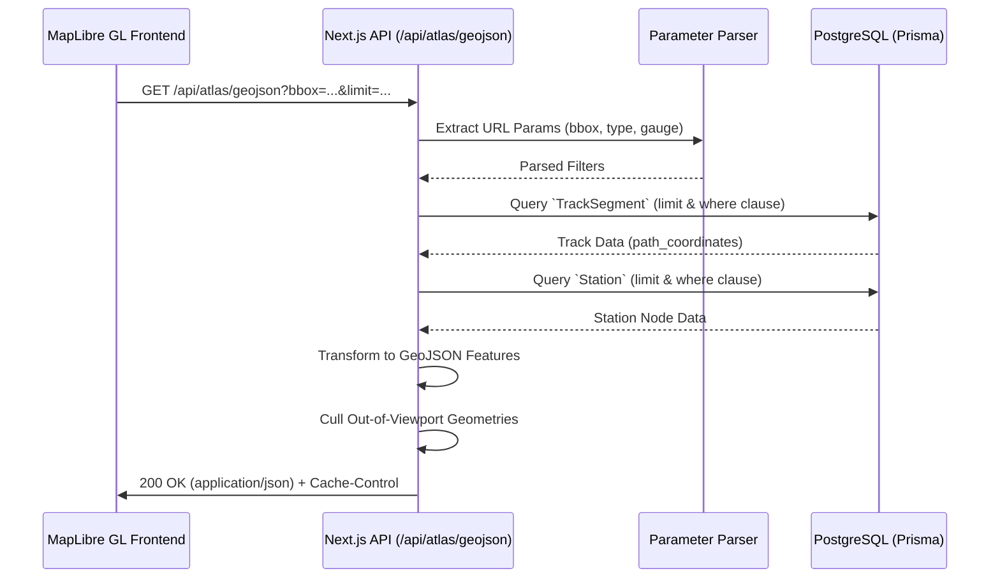

# Atlas GeoJSON Service

## Executive Summary
The Atlas GeoJSON Service is a high-performance read-only delivery module designed to query, filter, and stream Indian Railway topological data (tracks and stations) to frontend map clients (e.g., MapLibre GL). It acts as the "Gold Layer/Delivery Mechanism" in the OneRail architecture, abstracting complex PostgreSQL relational queries into standardized geospatial payloads (GeoJSON FeatureCollections) while adhering to strict viewport limits to preserve client-side rendering performance.

## Architecture & Logic Flow
This service acts statelessly per HTTP request. It leans on Prisma ORM for database connectivity, executing highly optimized selective queries based on dynamic search parameters.

**Logic Flow:**
1. **Request Ingestion:** The service intercepts a `GET` request and parses URL Search Parameters (`bbox`, `type`, `gauge`, `status`, `limit`).
2. **Filter Construction:** Dynamically constructs Prisma `where` clauses based on the presence of optional filters.
3. **Database Querying:**
   - If `type` includes `tracks`, it scans `TrackSegment` joining node coordinates dynamically if native spatial `path_coordinates` arrays are missing.
   - If `type` includes `stations`, it scans `Station`, explicitly stripping out internal routing-only `OSM_` virtual hubs.
4. **Data Transformation & Algorithmic Filtering:** Both database result sets are iteratively transformed into GeoJSON `Feature` objects (`LineString`s for tracks, `Point`s for stations). If a `bbox` is supplied, an algorithmic intersection check is executed to cull geometries entirely outside the viewport.
5. **Response Delivery:** Assembles a `FeatureCollection` wrapping the features, embeds pipeline metrics inside `metadata`, injects a `Cache-Control` stale-while-revalidate header, and resolves the HTTP response.



## API & Interface Reference

### Exports/Methods

| Method | Type | Description |
| :--- | :--- | :--- |
| `GET(req: NextRequest)` | `async function` | Core server route handler. Parses the request, generates Prisma filters, structures GeoJSON mappings, and streams responses. |

### Endpoints

**`GET /api/atlas/geojson`**

**Request Query Parameters:**

| Parameter | Type | Required? | Default | Description |
| :--- | :--- | :--- | :--- | :--- |
| `bbox` | `string` | No | `null` | Bounding box `minLon,minLat,maxLon,maxLat` to restrict returned geometries. |
| `type` | `enum` | No | `'all'` | Specifies the layer to return: `'tracks'`, `'stations'`, or `'all'`. |
| `gauge` | `string` | No | `null` | Filters tracks by gauge size (e.g., `'BG'`, `'MG'`, `'NG'`). |
| `status` | `string` | No | `null` | Filters tracks by operation status (e.g., `'Operational'`, `'Under Construction'`). |
| `limit` | `number` | No | `50000` | Hard cap on the number of DB records fetched (ceiling: 100,000). |

**Response Codes:**

| Code | Meaning | Body Schema |
| :--- | :--- | :--- |
| `$200$` | Success | `{ type: "FeatureCollection", features: [...], metadata: { total, tracks, stations, generated_at } }` |
| `$500$` | Server Error | `{ error: string }` |

## Service Dependencies

* **Internal Modules:**
  * `@/lib/prisma`: Reusable configured Prisma ORM client for PostgreSQL DB connection pooling.
* **External Side-Effects:**
  * **Database (Read-Only):** Triggers `findMany` lookups against `Station` and `TrackSegment` tables. 
  * **Caching:** Injects HTTP edge/proxy caching directives relying on downstream Vercel or CDN caches.

## Usage Examples

### Basic Implementation
The simplest configuration for mapping the entire network indiscriminately:

```javascript
fetch('/api/atlas/geojson')
  .then(res => res.json())
  .then(geojson => {
      console.log(`Loaded ${geojson.metadata.total} features.`);
      map.getSource('railways').setData(geojson);
  });
```

### Advanced Configuration
Utilizing precision viewport filtering and specific layer queries to maintain high framerates during rendering.

```javascript
async function updateMapViewport(bounds) {
    const { _sw, _ne } = bounds;
    // Construct Antigravity vibe bounding box parameters
    const bboxParam = `${_sw.lng},${_sw.lat},${_ne.lng},${_ne.lat}`;
    
    const url = new URL('/api/atlas/geojson', window.location.origin);
    url.searchParams.append('bbox', bboxParam);
    url.searchParams.append('type', 'tracks');
    url.searchParams.append('gauge', 'BG'); 
    url.searchParams.append('status', 'Operational');
    url.searchParams.append('limit', '5000'); // Snappy chunk size

    const response = await fetch(url);
    if (!response.ok) throw new Error('Failed to fetch rail vectors');
    
    return await response.json();
}
```

## Error Handling & Edge Cases

* **Malformatted Bounding Boxes:** If client-provided coordinate strings throw `NaN` on parse, the service logs no faults. It bypasses viewport-locking to gracefully degrade to returning the maximum dataset allowed by the `limit` variable.
* **Malformed Coordinates:** Records within `TrackSegment` missing proper inner `path_coordinates` or failing fallback junction relationships are skipped via `continue`, preventing frontend geometry parse faults.
* **Payload OOM:** `limit` variable inputs are forcefully clamped at `100,000` preventing memory overloads scaling against hostile HTTP requests. 
* **Database Timeout:** Standardized `try/catch` wrapper intercepts downstream ORM connection failures, isolating error messages into a stripped down JSON object to prevent internal stack-trace leaks into the HTTP body payload.

## Contribution Notes

* **Loop Efficiency Constraint:** Code added inside the primary GeoJSON array assemblers runs $N$ times (upwards to 100,000 iterations). Avoid allocating expensive class instances (e.g. strict mapping models) and rely on generic JavaScript object notation formats for transformation.
* **Prisma Population Warning:** Avoid attaching nested relationships (`include: {}`) during the `TrackSegment` fetches; this will exponentially hike Lambda/Node RAM footprint causing edge execution drops.
* **Immutable Station Hub Rules:** The station retrieval must explicitly append `{ station_code: { not: { startsWith: 'OSM_' } } }`. Without this filter mapping, the response will push redundant `Virtual Hubs` to the UI, corrupting the cartographic UX point visualizations.
