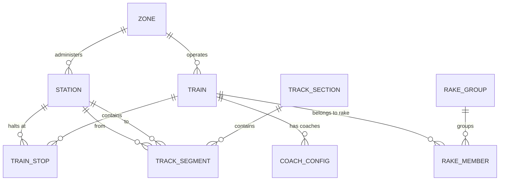

# OneRail: Database Source of Truth

## Executive Summary

The OneRail database is the "Gold Layer" of the data pipeline — a structured, validated, and performance-optimized repository for Indian Railways schedule data and geographic track topology. It serves two distinct consumers: the Next.js API (schedule queries) and the MapLibre GL frontend (GeoJSON vector tiles).

## Technology Stack

- **Database:** PostgreSQL 14+ — chosen for robust JSONB support and high-performance indexing.
- **ORM:** Prisma 7 — type-safe database access with driver adapter support.
- **Driver Adapter:** `@prisma/adapter-pg` wrapping a `pg.Pool` — required by Prisma 7 (direct URL connection was removed).
- **Language:** TypeScript throughout.
- **Client singleton:** `web/src/lib/prisma.ts` — always import from here, never instantiate `PrismaClient` directly.

---

## Schema: All Models

### 1. Zone

Administrative divisions of Indian Railways. There are 18 zones (SR, NR, CR, WR, etc.).

| Field | Type | Description |
|---|---|---|
| `zone_code` | `String` `@id` | Primary key (e.g. "SR", "NR") |
| `zone_name` | `String` | Full name (e.g. "Southern Railway") |
| `headquarters` | `String` | HQ city |

---

### 2. Station

Every rail node — real stations and OSM geometry nodes (virtual hubs).

| Field | Type | Description |
|---|---|---|
| `station_code` | `String` `@id` | Primary key. Real stations use official codes (e.g. "MAS"). OSM nodes use `OSM_<node_id>`. |
| `station_name` | `String` | Human-readable name |
| `state` | `String?` | Indian state |
| `zone_code` | `String?` | FK → Zone |
| `latitude` | `Float?` | WGS84 latitude |
| `longitude` | `Float?` | WGS84 longitude |
| `elevation_m` | `Float?` | Elevation in metres |
| `station_category` | `String?` | A1 (major terminals) → F (halt stations) |
| `num_platforms` | `Int?` | Number of platforms |
| `is_junction` | `Boolean` | True if this is a junction station |
| `is_terminus` | `Boolean` | True if this is an end-of-line station |
| `has_retiring_room` | `Boolean` | Amenity flags (scraper-populated) |
| `has_waiting_room` | `Boolean` | |
| `has_food_plaza` | `Boolean` | |
| `has_wifi` | `Boolean` | |

**Virtual hubs** (`OSM_*` codes) are geometry-only nodes with no timetable data. They exist to satisfy `TrackSegment` FK constraints for OSM track nodes that don't correspond to a real station. There are ~135,000 of them vs ~9,900 real stations.

---

### 3. Train

One record per train service.

| Field | Type | Description |
|---|---|---|
| `train_number` | `String` `@id` | 5-digit number (e.g. "12658") |
| `train_name` | `String` | Name (e.g. "Tamil Nadu Express") |
| `train_type` | `String` | Category: Rajdhani, Shatabdi, Vande Bharat, Duronto, Garib Rath, Superfast Express, Express, Passenger, EMU, MEMU, DEMU, Heritage, Special |
| `source_station_code` | `String` | FK → Station |
| `destination_station_code` | `String` | FK → Station |
| `total_distance_km` | `Float?` | End-to-end distance |
| `total_duration_mins` | `Int?` | End-to-end duration |
| `run_days` | `Int` | Bitmask: Mon=1, Tue=2, Wed=4, Thu=8, Fri=16, Sat=32, Sun=64. Daily=127. |
| `zone_code` | `String?` | FK → Zone (currently null for all trains — needs backfill) |
| `locomotive_type` | `String?` | Electric, Diesel, Hybrid, Steam |
| `classes_available` | `String[]` | e.g. `["1A","2A","3A","SL","GN"]` |
| `has_pantry` | `Boolean` | |
| `bedroll_available` | `Boolean` | |
| `pantry_menu` | `String?` | |
| `first_run_date` | `String?` | Inaugural date |
| `max_speed` | `String?` | |
| `rake_share_text` | `String?` | Raw rake sharing text from source |

---

### 4. TrainStop

The central table — maps every train's stop-by-stop journey. This is the most queried table in the system.

| Field | Type | Description |
|---|---|---|
| `id` | `Int` `@id` | Auto-increment |
| `train_number` | `String` | FK → Train |
| `station_code` | `String` | FK → Station |
| `stop_sequence` | `Int` | Position in journey (1 = source) |
| `arrival_time_mins` | `Int?` | Minutes from midnight of Day 1 |
| `departure_time_mins` | `Int?` | Minutes from midnight of Day 1 |
| `halt_duration_mins` | `Int?` | Computed halt time |
| `day_number` | `Int` | 1 = departs on scheduled day, 2 = next day, etc. |
| `distance_from_source_km` | `Float?` | Cumulative km from source |
| `platform_number` | `String?` | |
| `is_technical_halt` | `Boolean` | Loco changes, crew changes — hidden in UI by default |
| `xing` | `String?` | Crossing info |
| `intermediate_stations` | `Int?` | Count of minor stops between this and next stop |

**Unique constraint:** `[train_number, stop_sequence]`

**Time encoding:** Times are stored as absolute integers from midnight of Day 1 of the journey. An arrival at 01:20 on Day 2 is stored as `1520` (1440 + 80). Use `day_number` to get the actual calendar day. This encoding makes SQL range queries trivial.

---

### 5. CoachConfig

Physical rake composition — which coaches are in which position on a specific train.

| Field | Type | Description |
|---|---|---|
| `id` | `Int` `@id` | Auto-increment |
| `train_number` | `String` | FK → Train |
| `class_code` | `String` | 1A, 2A, 3A, SL, GN, CC, EC, FC |
| `coach_label` | `String` | Physical label (A1, S5, B3, GS, etc.) |
| `position_in_train` | `Int` | 1 = loco end |
| `num_seats` | `Int?` | Seat count for this coach |

---

### 6. RakeGroup

A rake sharing group — a set of trains that share the same physical rake (coaches and locomotive). When Train A arrives at a terminal, the same rake departs as Train B.

| Field | Type | Description |
|---|---|---|
| `group_id` | `Int` `@id` | Auto-increment |
| `notes` | `String?` | Freeform notes about the RSA arrangement |

---

### 7. RakeMember

Maps a train to its rake sharing group.

| Field | Type | Description |
|---|---|---|
| `id` | `Int` `@id` | Auto-increment |
| `group_id` | `Int` | FK → RakeGroup |
| `train_number` | `String` | FK → Train |
| `sequence_in_group` | `Int` | Order in which trains use the rake |

**Unique constraint:** `[group_id, train_number]`

---

### 8. TrackSegment

The atomic geographic unit — a physical piece of track between two adjacent nodes. Raw OSM data populates this table.

| Field | Type | Description |
|---|---|---|
| `id` | `Int` `@id` | Auto-increment |
| `from_station_code` | `String` | FK → Station |
| `to_station_code` | `String` | FK → Station |
| `distance_km` | `Float?` | Segment length |
| `track_type` | `String?` | Single, Double, Multi |
| `electrified` | `Boolean` | |
| `gauge` | `String` | BG (1676mm), MG (1000mm), NG (762/610mm). 1435mm standard gauge (metro) is rejected at import and never stored. |
| `status` | `String` | Operational, Under Construction, Proposed |
| `zone_code` | `String?` | |
| `mps` | `Int?` | Max Permissible Speed (km/h) |
| `track_section_id` | `Int?` | FK → TrackSection (nullable) |
| `path_coordinates` | `Json?` | GeoJSON `[[lon, lat], ...]` array |

**Unique constraint:** `[from_station_code, to_station_code]`

Endpoints can be real station codes or `OSM_*` virtual hub codes. ~94,000 segments are OSM-to-OSM; ~7,000 have at least one real station endpoint.

---

### 9. TrackSection

A logical corridor grouping multiple consecutive segments between two meaningful anchor points (real stations or OSM topological junctions). Generated by `web/scripts/generate_sections.ts`, not scraped.

| Field | Type | Description |
|---|---|---|
| `id` | `Int` `@id` | Auto-increment |
| `from_node_code` | `String` | Start anchor (real station code or OSM junction) |
| `to_node_code` | `String` | End anchor |
| `distance_km` | `Float` | Total corridor distance |
| `mps` | `Int?` | Max Permissible Speed |
| `track_type` | `String?` | Majority-voted from member segments |
| `electrified` | `Boolean` | True if all member segments are electrified |
| `status` | `String` | Majority-voted from member segments |
| `gauge` | `String` | |
| `zone_code` | `String?` | |
| `num_stations` | `Int` | Count of nodes in this section (including endpoints) |
| `path_coordinates` | `Json?` | Combined GeoJSON for the full corridor |

**Relationship to TrackSegment:** One-to-many. Each `TrackSegment` has a nullable `track_section_id`. Sections are regenerated by clearing all assignments and re-running the generator.

---

## Data Overview & FAQ

This section answers the questions that every new contributor asks when they first look at the database counts.

### Current counts (as of March 2026)

| Table | Count | Notes |
|---|---|---|
| Train | ~6,700 | Partial — see below |
| Station | ~144,700 | Includes virtual hubs — see below |
| TrainStop | ~500,000+ | One row per stop per train |
| TrackSegment | ~101,400 | Raw OSM geometry |
| TrackSection | Varies | Regenerated — see scripts |

---

### Why are there only ~6,700 trains? Indian Railways runs ~13,000.

The scraper (`tools/scrape_all_trains.mjs`) enumerates IndiaRailInfo's **internal IDs**, not train numbers. These IDs are non-contiguous integers starting from 1. The scrape has only been run up to internal ID ~13,000 so far, which yielded ~6,700 valid trains (the rest were 404s or placeholder entries).

Full national coverage requires running the scraper up to ID ~50,000. This is a known gap tracked in the ROADMAP. The trains we do have span all series (12xxx expresses, 5xxxx passengers, 6xxxx/7xxxx EMUs, etc.) but are not uniformly distributed — some series are more complete than others.

Additionally, all trains currently have `zone_code = null` because zone assignment hasn't been backfilled yet.

---

### Why are there 144,000+ stations when Indian Railways only has ~7,000–8,000?

The `Station` table holds two very different kinds of records:

**Real stations (~9,900)** — actual Indian Railways stations with official station codes (e.g. `MAS`, `NDLS`, `SBC`). These come from the train schedule scraper and represent places where trains actually stop.

**Virtual hubs (~134,800)** — synthetic records with `OSM_<node_id>` codes (e.g. `OSM_10002086655`). These are OpenStreetMap geometry nodes — every curve, switch, and interpolation point along a railway line in OSM. They exist purely so that `TrackSegment` foreign key constraints can be satisfied. They have coordinates but no timetable data, no amenities, and no platforms. They are not real places.

You can distinguish them in any query:
```sql
-- Real stations only
SELECT * FROM "Station" WHERE station_code NOT LIKE 'OSM_%';

-- Virtual hubs only
SELECT * FROM "Station" WHERE station_code LIKE 'OSM_%';
```

The UI already filters to real stations only. Virtual hubs never appear in search results.

---

### What is the difference between a TrackSegment and a TrackSection?

**TrackSegment** is the atomic unit — a physical piece of track between two **adjacent nodes** (which can be real stations or OSM geometry nodes). It stores the raw GeoJSON geometry (`path_coordinates`) for that specific piece. There are ~101,000 segments.

**TrackSection** is a logical grouping — a corridor of consecutive segments between two **meaningful anchor points** (real stations, or OSM topological junctions where track branches). For example, all the segments between Chennai Central and Tambaram would form one TrackSection. It stores combined `path_coordinates` for the full corridor for easier map rendering.

Think of it this way:
- Segments are the **bricks**
- Sections are the **walls** (logical runs of bricks between corners)

Sections are not scraped — they are generated by `web/scripts/generate_sections.ts`, which walks the segment graph and groups consecutive segments. They can always be regenerated from scratch.

Key rule: **real station codes are always section boundaries**, regardless of their graph degree. This ensures sections represent meaningful station-to-station corridors rather than arbitrary OSM topology cuts.

---

## Entity Relationship Diagram



---

## Performance & Optimization

- **Indexes on TrainStop:** Composite on `[train_number, station_code]`, individual on `train_number` and `station_code`. This is the hottest table.
- **Indexes on TrackSegment:** Individual on `from_station_code` and `to_station_code` for graph traversal.
- **GeoJSON as JSONB:** `path_coordinates` stored as plain JSON arrays (not PostGIS geometry). Simpler MapLibre integration and no PostGIS dependency.
- **Viewport culling:** The Atlas API pre-filters by bounding box at the database level before returning GeoJSON.
- **Client-side cache:** The Atlas frontend caches GeoJSON responses in IndexedDB (`clientCache.ts`). Bump the `cacheKey` version in `atlas/page.tsx` after any coordinate or geometry updates.

---

## Maintenance

| Task | Command |
|---|---|
| Apply schema changes | `cd web && npx prisma db push` |
| Regenerate track sections | `npx tsx scripts/generate_sections.ts --skip-clear` |
| Clear and regenerate sections | Run `clear_sections.ts` then `generate_sections.ts --skip-clear` |
| Recover missing station coords | `npx tsx scripts/bulk_recover_geography.js` |
| Check for data gaps | `npx tsx scripts/audit_missing_hubs.js` |
