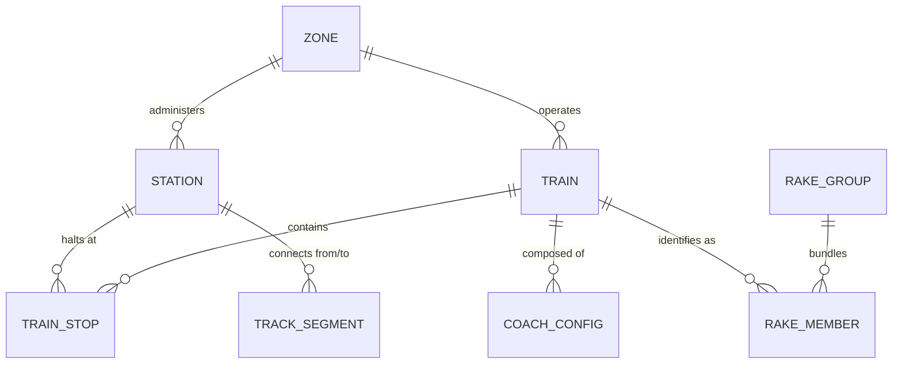

# OneRail: Database Source of Truth

## Executive Summary
The OneRail database architecture is designed to handle high-concurrency geospatial queries and complex relational railway schedule data. It serves as the "Gold Layer" of the ecosystem, providing a structured, validated, and performance-optimized repository for the Indian Railway network, train schedules, and real-time mapping vectors.

## Technology Stack
- **Database Engine:** PostgreSQL (v14+) — Chosen for robust JSONB support and high-performance indexing.
- **ORM & Schema Management:** Prisma (v5+) — Provides type-safe database access and automated migration workflows.
- **Language:** TypeScript — Ensures end-to-end data integrity from DB to UI.
- **Deployment Pattern:** Force-dynamic API routes for real-time GeoJSON streaming.

## Schema Architecture & Table Reference

### 1. Zone
Represents the administrative divisions of Indian Railways.
| Field | Type | Flags | Description |
| :--- | :--- | :--- | :--- |
| `zone_code` | `String` | `@id` | Primary Key (e.g., "SR", "NR"). |
| `zone_name` | `String` | - | Full name of the zone. |
| `headquarters` | `String` | - | Administrative HQ city. |

### 2. Station
Geographic and amenity metadata for every rail node.
| Field | Type | Flags | Description |
| :--- | :--- | :--- | :--- |
| `station_code` | `String` | `@id` | Primary Key (e.g., "MAS", "NDLS"). |
| `station_name` | `String` | - | Human-readable name. |
| `zone_code` | `String?` | `@relation` | Foreign Key to `Zone`. |
| `latitude/longitude` | `Float?` | - | WGS84 coordinates for mapping. |
| `is_junction` | `Boolean` | `@default(false)` | Flag for topology rendering. |
| `is_terminus` | `Boolean` | `@default(false)` | Flag for end-of-line nodes. |

### 3. Train
Core scheduling entity for passenger and express services.
| Field | Type | Flags | Description |
| :--- | :--- | :--- | :--- |
| `train_number` | `String` | `@id` | Unique identifier (e.g., "12658"). |
| `train_name` | `String` | - | Descriptive name (e.g., "Tamil Nadu Express"). |
| `train_type` | `String` | - | Category (Vande Bharat, Superfast, etc.). |
| `run_days` | `Int` | `@default(127)` | Bitmask for operation days (Mon=1 ... Daily=127). |
| `source_station_code` | `String` | `@relation` | Starting station. |
| `destination_station_code`| `String` | `@relation` | Ending station. |

### 4. TrainStop (Central Junction)
The relationship bridge between Trains and Stations, mapping the entire journey.
| Field | Type | Flags | Description |
| :--- | :--- | :--- | :--- |
| `id` | `Int` | `@id` | Auto-incrementing internal ID. |
| `train_number` | `String` | `@relation` | Link to `Train`. |
| `station_code` | `String` | `@relation` | Link to `Station`. |
| `stop_sequence` | `Int` | - | Sequential order of the halt. |
| `arrival_time_mins` | `Int?` | - | Minutes from midnight (normalized). |
| `departure_time_mins` | `Int?` | - | Minutes from midnight (normalized). |
| `day_number` | `Int` | `@default(1)` | Journey day offset. |

### 5. TrackSegment (Geospatial Core)
Defines the physical vectors for the Atlas map.
| Field | Type | Flags | Description |
| :--- | :--- | :--- | :--- |
| `id` | `Int` | `@id` | Internal ID. |
| `from_station_code` | `String` | `@relation` | Start of segment. |
| `to_station_code` | `String` | `@relation` | End of segment. |
| `gauge` | `String` | `@default("BG")` | Track gauge (BG, MG, NG). |
| `path_coordinates` | `Json?` | - | **GeoJSON LineString** (Array of `[lon, lat]`). |
| `status` | `String` | - | Operational, Under Construction, etc. |

## Relationship Mapping Info

### Key Integrity Rules:
1. **One-to-Many:** A `Zone` administers multiple `Stations` and `Trains`.
2. **Junction Logic:** `TrainStop` is a many-to-many bridge between `Train` and `Station`. Uniqueness is enforced on `[train_number, stop_sequence]` to prevent journey logical errors.
3. **Geo-Relational:** `TrackSegment` relies on two distinct relationships to the `Station` table (`TrackFrom`, `TrackTo`) and uses a unique constraint on the station pair to prevent redundant vector data.
4. **Normalized Time:** All times (`arrival_time_mins`, `departure_time_mins`) are stored as absolute integers (0 to 1439+) to allow for easy mathematical comparisons across day boundaries.

## Performance & Optimization Strategy

- **Index Optimization:**
    - Composite indexes on `TrainStop([train_number, station_code])` for fast journey lookups.
    - Spatial-adjacent indexes on `TrackSegment(from_station_code, to_station_code)` for rapid graph traversal.
- **GeoJSON Handling:** `path_coordinates` are stored as JSONB. Although Postgres supports PostGIS, OneRail prioritizes raw JSON arrays for simpler MapLibre GL integration and lower CPU overhead on the API layer.
- **Viewport Filtering:** The database handles initial pruning (via `station_code` and `limit` filters) before the API layer applies the refined `bbox` overlap algorithm.

## Maintenance & Migrations
- **Sync Command:** `npx prisma db push` — Used for rapid iterative development.
- **Production Migrations:** `npx prisma migrate dev` — Used for versioned, repeatable schema changes.
- **Data Ingestion:** Large scale imports (e.g., OSM PBF or IRI Scraping) utilize Prisma's `upsert` patterns to ensure idempotency and prevent duplicate records on re-runs.
