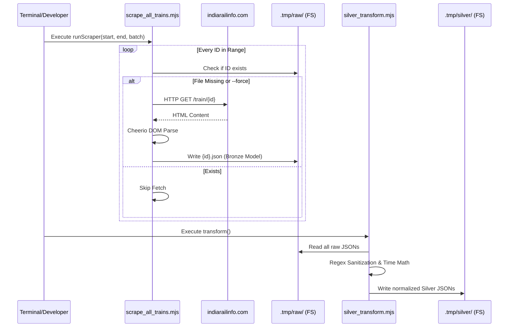

# IndiaRailInfo (IRI) ETL Pipeline

## Executive Summary
The IndiaRailInfo (IRI) ETL Pipeline is a standalone Node.js toolset (`tools/scrape_all_trains.mjs` and `tools/silver_transform.mjs`) responsible for the extraction, sanitation, and normalization of deep railway schedule data. Operating independently from the Next.js frontend, this service handles outbound scraping against `indiarailinfo.com`, leveraging Cheerio for DOM parsing. It solves the problem of acquiring comprehensive runtime intelligence (stops, max speeds, rake compositions) by systematically crawling legacy UI portals and depositing validated "Silver Layer" JSON objects into local storage for downstream database injection.

## Architecture & Logic Flow
The module leverages Antigravity’s "Bronze to Silver" data maturation concept. It operates statelessly in memory but uses the local filesystem (`.tmp/` directories) as a rigid caching layer to prevent duplicate network calls.

**Logic Flow:**
1. **Batch Enumeration:** The scraper defines an ID range and iterates over it in parameterized concurrent batches.
2. **Cache Check:** Before network execution, it checks if a `.json` file for the given ID already exists in `.tmp/raw`. If so, it skips (unless the `--force` flag is provided).
3. **Network Request:** A `fetch` call with a spoofed standard `User-Agent` and a 15-second abort signal targets `https://indiarailinfo.com/train/{id}`.
4. **DOM Parsing (Bronze):** `cheerio` loads the resolved HTML. Complex nested `<div>` and table structures are traversed to extract the train title, rake composition, and granular schedule rows (Arrival, Departure, Halts, Crossings). Resulting raw data is saved to `.tmp/raw/trains_by_id/{id}.json`.
5. **Sanitation & Normalization (Silver):** The secondary `silver_transform.mjs` script reads the raw Bronze JSON, strips Devanagari (Hindi) text via Regex, normalizes 24-hour timestamps into linear minutes from midnight, and validates KM/Time progression logic. Cleaned records are written to `.tmp/silver/trains/`.



## API & Interface Reference

### Core Methods (`scrape_all_trains.mjs`)

| Method/Function | Parameters | Return Type | Description |
| :--- | :--- | :--- | :--- |
| `scrapeTrainPage` | `id: number, force: boolean` | `Promise<boolean>` | Executes the core network fetch and DOM parsing for a discrete Train ID. Returns `true` on completion or `false` on network timeout/fatal catch. |
| `runScraper` | *(Reads `process.argv`)* | `Promise<void>` | Orchestrates batched concurrency over the integer ID range, manages retries, and enforces politeness delays. |

### CLI Interface (Endpoints equivalent)

The scraper utilizes CLI arguments rather than HTTP parameters to dictate execution flow.

**Command Structure:** `node tools/scrape_all_trains.mjs [startId] [endId] [batchSize] [--force]`

| Parameter | Type | Required? | Default | Description |
| :--- | :--- | :--- | :--- | :--- |
| `startId` | `number` | No | `1` | The IRI internal ID to begin scraping from. |
| `endId` | `number` | No | `25000` | The IRI internal ID to cease scraping. |
| `batchSize` | `number` | No | `10` | The number of concurrent `fetch` streams sent simultaneously. |
| `--force` | `flag` | No | `false` | Instructs the script to ignore `.tmp/raw` cache and forcefully re-request the HTML. |

## Service Dependencies

* **Internal Modules:** Uses Node native file-system standard libraries (`fs`, `path`, `timers/promises`).
* **External Side-Effects:**
  * **Network Scrape:** Fires thousands of outbound HTTP `GET` requests to `https://indiarailinfo.com`.
  * **File System Operations:** Directly creates and populates the `.tmp/` directory structure. Requires write permissions. 
* **NPM Packages:** 
  * `cheerio`: Core heavy-lifter for parsing the raw HTML DOM.

## Usage Examples

### Basic Implementation
To quietly resume scraping the entire known universe of ID arrays (relying on cache skips for previously pulled records):

```bash
# Starts from ID=1, goes to 25000, 10 concurrent requests at a time
node tools/scrape_all_trains.mjs
```

### Advanced Configuration
If a specific range recently observed an update on the portal and requires a forced overwrite across a tight concurrency batch to avoid IP blacklisting:

```bash
# Force rescan IDs 500 through 550, but deeply throttle to 2 concurrent threads
node tools/scrape_all_trains.mjs 500 550 2 --force
```

## Error Handling & Edge Cases

* **Connection Timeouts & Rate Limits:** The fetch is wrapped with a 15,000ms `AbortSignal`. If a request fails, it implements an exponential backoff loop `setTimeout(2000 * retries)`, attempting 3 total retries before abandoning the ID.
* **404 / 410 Deprecated Trains:** If the server natively returns HTTP `404` or the HTML H1 contains "Page Not Found", it correctly identifies this as a dead node, saves a valid Bronze JSON `{ internal_id: id, exists: false }`, and skips to prevent endless retries.
* **Imaginary Trains:** Community-generated "Imaginary" maps are detected by scanning the H1 text (e.g. `[img]` tags). The document saves but is flagged as `is_imaginary: true` so the DB injector can safely filter them out later.
* **Changing DOM Trees:** If the custom `.newschtable.newbg.inline` schedule class goes missing, it yields a safe error object `{ error: 'no_schedule_table' }` ensuring the script doesn't throw a terminal exception. 

## Contribution Notes

* **DOM Brittleness:** The logic extensively leverages specific HTML string patterns (`div:contains("Bedroll")`, `$('.rake > div')`). If IndiaRailInfo updates their frontend architecture, the regex inside `cheerio` maps will instantly break and yield `null` values. Monitor changes closely.
* **Politeness Delay Restrictions:** The `await setTimeout(1000)` between batches is strictly enforced. **Do not remove this.** Blasting the portal over 100 reqs/sec will result in automated CDN or IP blocks protecting against Layer 7 DDoS behavior. Keep `batchSize` limits sensible.
