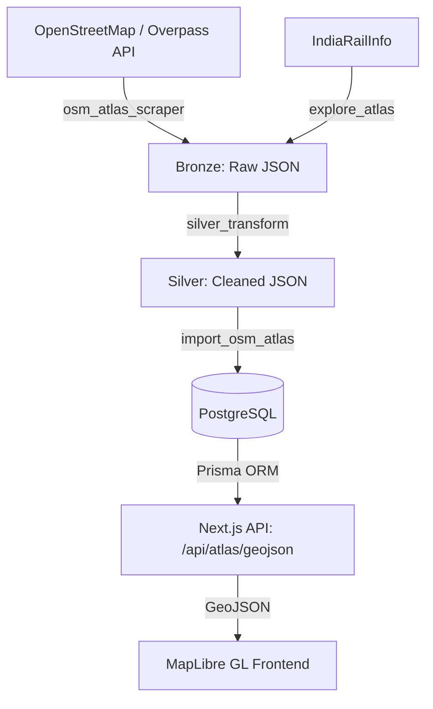

# OneRail: Technical Source of Truth

## System Overview & "The Vibe"
**OneRail** is a comprehensive, interactive railway network atlas and tracking application. The vibe is a high-performance, modern, and detailed mapping experience built for rail fans and developers, focusing on speed and cartographic clarity. The user experience philosophy emphasizes smooth interactions across a vast dataset, enabling users to seamlessly toggle layers (like gauge or construction status) and explore the entire Indian railway topological networks without frontend lag alongside train schedule intelligence.

## Architecture Deep Dive
The architecture acts as a pipeline that moves geographic and train schedule data through multiple refinement stages before rendering it on the frontend. 

1. **Bronze Layer (Ingestion):** Raw data is scraped from external sources such as OpenStreetMap (via Overpass API) and web portals (like IndiaRailInfo) and stored locally.
2. **Silver Layer (Transformation):** Raw JSON documents are sanitized, normalized, and validated to extract usable entities (like normalized stops, clean train names, and distinct geographic nodes).
3. **Gold Layer (Storage):** The validated data is loaded into a PostgreSQL database using Prisma ORM.
4. **Delivery Layer:** A Next.js API serves queried data dynamically as GeoJSON to a high-performance frontend client.

## Core Module Breakdown

### 1. `tools/osm_atlas_scraper.mjs`
* **Purpose:** Fetches raw railway track and station geographic data for a specific bounding box.
* **Technical Logic:** Constructs an Overpass QL query searching for **`railway=rail`** and **`railway=station`**. Submits an HTTP POST request to the Overpass API and saves the resulting JSON elements locally in a temporary directory.
* **Dependencies:** Node.js native **`fetch`** and **`fs`**.
* **Integration Points:** Connects to external `https://overpass-api.de/api/interpreter`.

### 2. `tools/silver_transform.mjs`
* **Purpose:** Cleans and normalizes raw train and schedule data from the Bronze directory into the Silver directory.
* **Technical Logic:** Parses complex Hindi/English train nomenclature to extract pure train numbers and names. Normalizes array of stops into calculated minute offsets from midnight. Validates distance (KM) progression and sequence logics, appending a validation flag matrix.
* **Dependencies:** Node.js native **`fs`** and **`path`**.
* **Integration Points:** Reads from `.tmp/raw/trains_by_id` and writes to `.tmp/silver/trains`.

### 3. `web/scripts/import_osm_atlas.ts`
* **Purpose:** Processes OSM JSON files and seeds the PostgreSQL database with track geometry and pseudo-stations.
* **Technical Logic:** Iterates over the OSM elements in two passes: mapping spatial nodes (**`lat`**/**`lon`**), and then parsing "ways" into unified **`TrackSegment`** records. Computes technical details like **`gauge`**, **`electrified`** status, and **`track_type`**. Generates virtual hub stations for the track end-nodes using an upsert mechanism to prevent duplication.
* **Dependencies:** **`fs`**, **`path`**, and the internal **`Prisma`** client.
* **Integration Points:** Direct database writes using Prisma ORM.

### 4. `web/src/app/api/atlas/geojson/route.ts`
* **Purpose:** The main endpoint that feeds map data to the frontend in a standardized geospatial format.
* **Technical Logic:** A Next.js API route that accepts query parameters (like **`bbox`**, **`type`**, **`gauge`**, **`status`**) and queries the corresponding PostgreSQL models (**`TrackSegment`** and **`Station`**). It translates Prisma results into a standardized **GeoJSON** `FeatureCollection` format containing `LineString`s and `Point`s. Implements viewport filtering algorithmically to constrain payload size. 
* **Dependencies:** **`NextRequest`**, **`NextResponse`**, and **`Prisma`**.
* **Integration Points:** Connects the database to the frontend client via standard HTTP GET requests.

### 5. `tools/explore_atlas.mjs`
* **Purpose:** An experimental utility to fetch and archive raw HTML from existing platforms for payload analysis.
* **Technical Logic:** Uses a simulated browser user-agent to bypass basic blocks, fetches the external DOM text, and archives it to `.tmp/atlas.html`. 
* **Dependencies:** Node.js native modules.
* **Integration Points:** Outbound HTTP scraping.

## Developer Experience (DX)

* **Environment Spin-up:** 
  Ensure PostgreSQL is running locally and your `.env` is configured. Run database migrations using `npx prisma db push` or `npx prisma migrate dev`.
  Start the frontend and API layers with `npm run dev` from the `web/` directory.
* **Running Ingestion Pipelines:**
  Execute bounding box scrapers (e.g., `node tools/osm_atlas_scraper.mjs`) and subsequent importers (e.g., `npx tsx web/scripts/import_osm_atlas.ts <filepath>`) to seed your local database. Use `node tools/silver_transform.mjs` to digest train schedules.
* **Vibe Checking the UI:**
  Navigate to your map wrapper endpoint. The map should feel buttery smooth. Zoom and pan the viewport to trigger dynamic box queries; observe the terminal to ensure backend `SQL` bounding boxes constrain rendering effectively.

## Edge Cases & Error Handling

* **Missing/Corrupted Coordinates:** If OSM ways contain fewer than 2 nodes, the pipeline skips the segment gracefully, preventing mapping errors down the line.
* **Viewport Overload:** The GEOJSON API enforces a hard ceiling (`limit=50000`) and leverages database-level bounding box filtering to prevent returning the entire India dataset to the client, which would crash the map renderer.
* **Time Sequence Violations:** The transformer script intelligently tags **`sequenceError`** if distance (km) goes backward or time math logic fails, flagging the document in validation rather than silently corrupting the dataset.
* **Upsert Conflict Resolution:** The database seeding uses `Prisma.upsert` based on unique node codes (**`OSM_...`**), allowing the importer script to be completely idempotent. You can safely restart a failed ingestion mid-way.
